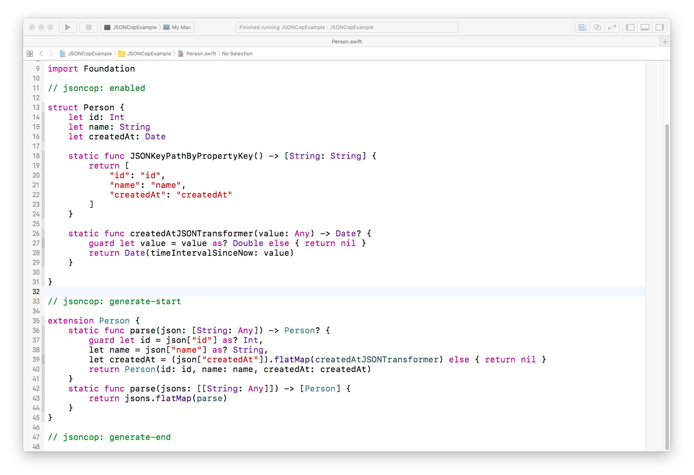

# JSONCop

[](https://github.com/draveness/jsoncop/blob/master/LICENSE)
[](http://rubygems.org/gems/jsoncop)
[](https://img.shields.io/badge/Swift-%203.0%20-yellow.svg)

JSONCop makes it easy to write a simple model layer for your Cocoa and Cocoa Touch application.

> JSONCop's APIs are highly inspired by [Mantle](https://github.com/Mantle/Mantle), you can use similar APIs to generate parsing methods with JSONCop.

```swift
let json: [String: Any] = [
    "id": 1,
    "name": "Draven",
    "createdAt": NSTimeIntervalSince1970
]
let person = Person.parse(json: json)
```

## Usage

1. Install JSONCop with `sudo gem install jsoncop --verbose` below in **system ruby version**
2. Run `cop install` in **project root folder**
3. **Add `//@jsoncop` just before model definition line**

```shell
$ sudo gem install jsoncop --verbose
$ cop install
```

```swift
//@jsoncop
struct Person {
    let id: Int
    let name: String
}
```

Then, each time build action is triggered, JSONCop would generate several parsing methods in swift files.



All the code between `// MARK: - JSONCop-Start` and `// MARK: - JSONCop-End` and will be replaced when re-run `cop install` in current project folder. Other codes will remain unchanged. Please don't write any codes in this area.

```swift
extension Person {
    static func parse(json: Any) -> Person? {
        guard let json = json as? [String: Any] else { return nil }
        guard let id = json["id"] as? Int,
			let name = json["name"] as? String,
			let projects = (json["projects"] as? [[String: Any]]).flatMap(projectsJSONTransformer) else { return nil }
        return Person(id: id, name: name, projects: projects)
    }
    static func parses(jsons: Any) -> [Person] {
        guard let jsons = jsons as? [[String: Any]] else { return [] }
        return jsons.flatMap(parse)
    }
}
```

Checkout [JSONCopExample](./JSONCopExample) for more information.

## Customize

+ JSON key to attribute customization

  ```swift
  struct Person {
      let id: Int
      let name: String

      static func JSONKeyPathByPropertyKey() -> [String: String] {
          return ["name": "nickname"]
      }
  }
  ```

+ Value transformer customization

  ```swift
  struct Person {
      let id: Int
      let name: String
      let gender: Gender
      let projects: [Project]

      enum Gender: Int {
          case male = 0
          case female = 1
      }

      static func genderJSONTransformer(value: Int) -> Gender? {
          return Gender(rawValue: value)
      }

      static func projectsJSONTransformer(value: [[String: Any]]) -> [Project] {
          return value.flatMap(Project.parse)
      }
  }
  ```

+ Nested JSON value extraction

  ```swift
  static func JSONKeyPathByPropertyKey() -> [String: String] {
      return ["currentProjectName": "project.name"]
  }
  ```

## Installation

```shell
sudo gem install jsoncop --verbose
```

## Contributing

Bug reports and pull requests are welcome on GitHub at https://github.com/draveness/jsoncop. This project is intended to be a safe, welcoming space for collaboration, and contributors are expected to adhere to the [Contributor Covenant](http://contributor-covenant.org) code of conduct.


## License

The gem is available as open source under the terms of the [MIT License](http://opensource.org/licenses/MIT).
